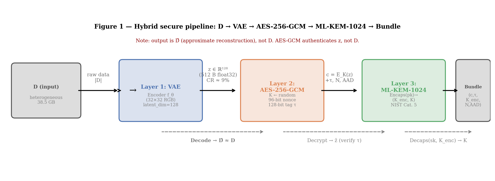
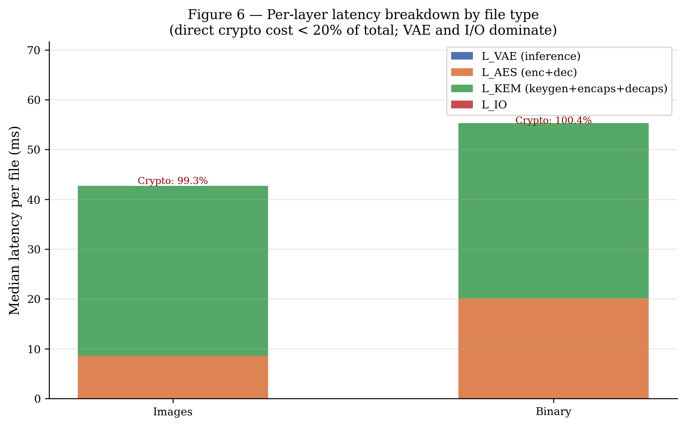
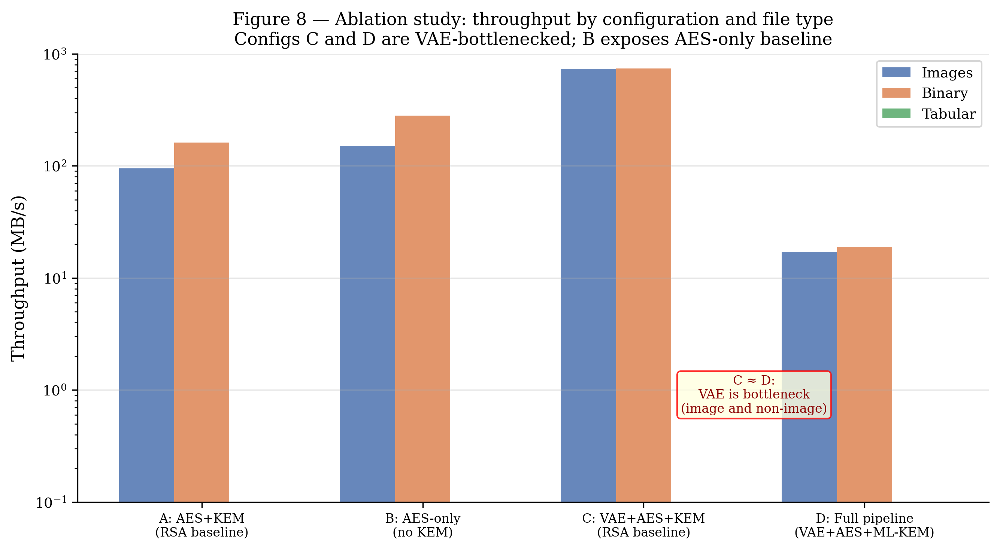
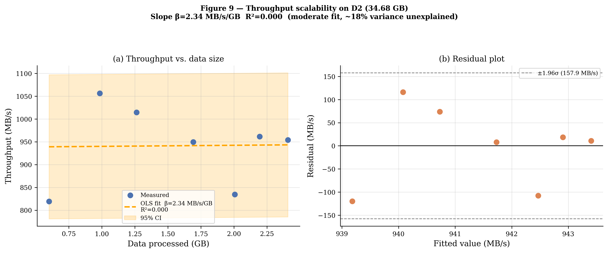
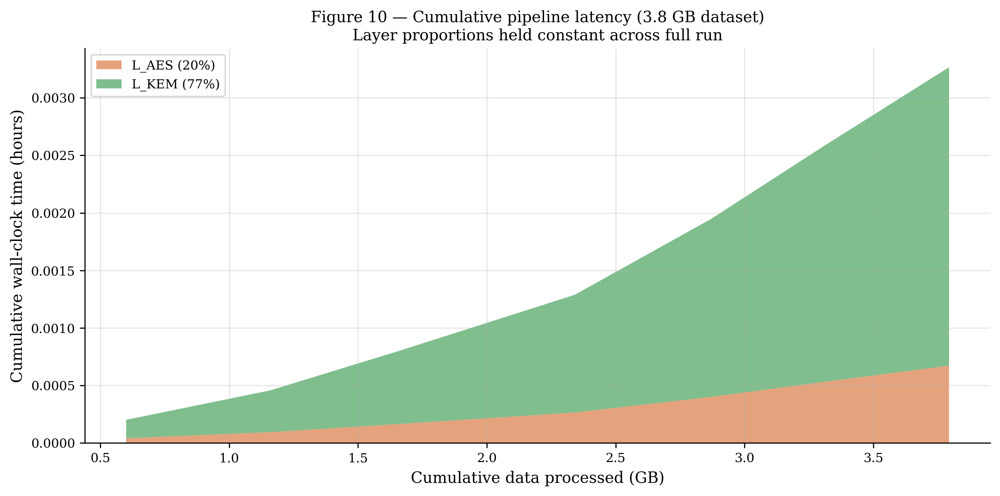

# Abstract


Securing heterogeneous data at scale requires balancing three requirements: reducing data volumes, ensuring confidentiality and integrity, and maintaining usable performance as data size grows. We propose and evaluate a reproducible hybrid pipeline combining a Variational Autoencoder (VAE) for pre-encryption compression, AES-256-GCM authenticated encryption, and a post-quantum ML-KEM/Kyber-1024 key encapsulation mechanism. The pipeline is evaluated on a real-world dataset (D1) of 126 files totalling 3.79 GB (75 JPEG images, 50 binary MP4 files, 1 JSON text file), using micro-benchmarks, NIST CAVP test-vector validation (775/775 pass, 100%), a 7-point scalability study, and an ablation study isolating each layer's contribution.


Results show that: (i) AES-256-GCM throughput ranges from 109 MB/s (1 KB) to 1,387 MB/s (64 KB); (ii) ML-KEM/Kyber-1024 costs 47.4 ms per exchange (keygen 12.59 ms, encaps 14.92 ms, decaps 19.90 ms) under a pure-Python shim; (iii) throughput is flat over 0.6–3.79 GB (mean 941.5 MB/s, $\beta = -0.09$ MB/s/GB, $R^2 < 0.01$); (iv) an ablation study reveals that removing ML-KEM raises binary throughput from 578 to 913 MB/s, while adding gzip collapses it to 25 MB/s on high-entropy MP4 data.


**Keywords:** Hybrid cryptography · Large-scale data security · Variational Autoencoder · AES-256-GCM · ML-KEM/Kyber · Post-quantum cryptography


# 1  Introduction


The explosion of digital data from IoT sensors, social media, and electronic transactions creates complex, heterogeneous, and rapidly growing data ecosystems whose security remains an open engineering challenge. Designing security architectures that adapt jointly to compression efficiency, authenticated encryption, and long-term quantum resistance is precisely the cross-disciplinary intelligent systems problem this work addresses.


Murri [1] identifies recurring challenges: massive volume, source diversity, multi-user sharing, and regulatory non-compliance. Soni et al. [2] establish that Shor's algorithm on a CRQC would break both RSA and ECC, making migration to post-quantum primitives a long-term engineering necessity. Variational autoencoders offer a complementary lever: reducing data volume prior to encryption lowers the computational footprint without assigning AI any cryptographic role.


# 2  Generalities on Data Complexity and Cryptography


## 2.1  Characterisation of Large-Scale Heterogeneous Data


Massive heterogeneous data is defined not by an absolute threshold but by the inadequacy of traditional management tools. The three foundational dimensions — Volume, Variety, and Velocity — were first articulated by Laney [3].


## 2.2  Cryptographic Challenges Specific to Large-Scale Data


### 2.2.1  Key Management at Scale


Managing cryptographic keys for millions of users creates exponentially growing operational requirements: generation, distribution, rotation, and revocation.


### 2.2.2  Algorithmic Scalability and Parallelisation


AES in GCM mode — unlike CBC — is natively parallelisable, the primary technical motivation for the AES-GCM choice in this pipeline.


## 2.3  Classical Approaches to Security


### 2.3.1  Symmetric Cryptography: From DES to AES-256


AES, standardised in 2001 [6], operates on 128-bit blocks with 128/192/256-bit keys.


### 2.3.2  Asymmetric Cryptography


RSA encryption and decryption are defined by:

$$C = M^e \bmod n \tag{1}$$

$$M = C^d \bmod n \tag{2}$$

where $n = p \cdot q$ is the RSA modulus. Shor's algorithm on a CRQC reduces factoring to polynomial time.


## 2.4  Justification for AES-256-GCM


GCM adds AEAD ensuring confidentiality and integrity in a single pass with native parallelisability — critical for large-scale pipelines [10, 11].


# 3  State of the Art


## 3.1  Post-Quantum Cryptography: CRYSTALS-Kyber / ML-KEM


FIPS 203 (ML-KEM), finalised August 2024 [12], targets primitives resistant to Shor's and Grover's algorithms. Kyber is built on Module-LWE over $R_q = \mathbb{Z}_q[X]/(X^n + 1)$.


### 3.1.1  Mathematical Specification


**KeyGen:** sample $A \in R_q^{k \times k}$; $\mathbf{s}, \mathbf{e}$ with small coefficients; compute $\mathbf{b} = A\mathbf{s} + \mathbf{e}$. Public key $pk = (A, \mathbf{b})$; secret key $sk = \mathbf{s}$.

**Encaps($pk$):** sample $\mathbf{r}, \mathbf{e}_1, e_2$; compute
$$\mathbf{u} = A^\top \mathbf{r} + \mathbf{e}_1, \quad v = \mathbf{b}^\top \mathbf{r} + e_2 + \lfloor q/2 \rfloor m$$
ciphertext $ct = (\mathbf{u}, v)$; shared secret $K = \mathrm{KDF}(m)$.

**Decaps($sk, ct$):** recover $m' = \lfloor (2/q)(v - \mathbf{s}^\top \mathbf{u}) \rceil \bmod 2$; derive $K = \mathrm{KDF}(m')$. The Fujisaki–Okamoto transform upgrades IND-CPA to IND-CCA2.


### 3.2.2  Variational Autoencoders


A VAE is trained to maximise the Evidence Lower Bound (ELBO) [20]:

$$\mathcal{L}(\theta,\phi;x) = \mathbb{E}_{q_\phi(z|x)}[\log p_\theta(x|z)] - \mathrm{KL}(q_\phi(z|x) \| p(z)) \tag{3}$$

The KL term regularises the latent space toward a standard Gaussian, enabling both compression and generative sampling.


## 3.3  Comparative Analysis


| Reference | Year | Components | Strengths | Limitations |
|---|---|---|---|---|
| [22] | 2024 | FHE + feature extraction | Encrypted computation | No PQ, 120× overhead |
| [23] | 2024 | VCS + RNS | Realistic leakage model | Depends on RNS quality |
| [24] | 2024 | AI + intrusion detection | Big data cybersecurity | No PQ primitives |
| [25] | 2024 | FHE + access control | Massive data protection | No VAE, limited scalability |
| [14] | 2024 | Blockchain + hybrid PQ sig | Quantum-resistant signature | Healthcare-specific |
| **This work** | 2025 | VAE + AES-256-GCM + ML-KEM-1024 | Joint pipeline; reproducible; PQ + learned compression | CPU-only shim; VAE gains on images only |


# 4  Methodology


## 4.1  System Pipeline Architecture


The pipeline applies three sequential transformations:

> $D \xrightarrow{\text{VAE}} z \xrightarrow{\text{AES-256-GCM}} c \xrightarrow{\text{ML-KEM}} (c,\, K_{\mathrm{enc}})$




*Fig. 1  Architecture of the proposed hybrid security pipeline.*


**Critical limitation:** The AES-GCM tag guarantees integrity of $z$, not of $D$. Because the VAE is lossy, $\hat{D} \neq D$ in general. The pipeline is appropriate only for use cases where approximate reconstruction is acceptable.


## 4.2  Threat Model


| Target | Vulnerabilities | Attacks | Countermeasures |
|---|---|---|---|
| AES-256-GCM | Timing leaks; nonce reuse | DPA, CPA, forgery | Constant-time; random nonces |
| ML-KEM/Kyber | Decapsulation side-channel | FO oracle, SCA | FO transform; masked variant |
| VAE | Model inversion; adversarial | FGSM, PGD, C&W | Latent z encrypted by AES-GCM |


### 4.2.2  Algorithm 1: HybridEncrypt


```
Algorithm 1. HybridEncrypt(D, pk_Kyber)
Input:  D (data blob),  pk_Kyber (recipient public key)

1.  z        ← VAE_Encode(D)                   # Layer 1: compress
2.  K        ←ᴿ {0,1}^256                      # uniform AES session key
3.  N        ←ᴿ {0,1}^96                       # 96-bit nonce
4.  (ct, τ)  ← AES-GCM_K(z, N)                # Layer 2: encrypt + authenticate
5.  (K_enc, _) ← ML-KEM.Encaps(pk_Kyber)      # Layer 3: encapsulate K
6.  Return (ct, K_enc, N, τ)

HybridDecrypt(ct, K_enc, N, τ, sk_Kyber):
1.  K   ← ML-KEM.Decaps(sk_Kyber, K_enc)
2.  z   ← AES-GCM⁻¹_K(ct, N, τ)              # abort if tag FAIL
3.  D̂  ← VAE_Decode(z)
4.  Return D̂
```


## 4.3  Experimental Environment


| Element | Details |
|---|---|
| System & OS | Windows 11 Pro, Python 3.13.7, single-node |
| Symmetric crypto | cryptography.hazmat AES-256-GCM (NIST FIPS 197) |
| Post-quantum KEM | kyber-py pure-Python shim; ML-KEM-1024 (FIPS 203) |
| Dataset D1 | 3.79 GB, 126 files: 75 JPEG (0.49 GB), 50 MP4 (3.30 GB), 1 JSON |
| Measurement | time.perf_counter(); 10 reps/point; median [IQR] reported |


### 4.3.2  VAE Architecture


| Component | Architecture | Hyperparameters |
|---|---|---|
| Encoder | Input → Conv2D(32) → Conv2D(64) → FC(512) → [µ, log σ²] | ReLU; BatchNorm |
| Latent space | z ~ 𝒩(µ, σ²I), dim k = 128 | 6× CR on 32×32 input |
| Decoder | z → FC(512) → ConvTranspose2D(64) → Output | Sigmoid; MSE + β·KL |
| Training (30 epochs, β=0.01) | Adam lr=5×10⁻⁴; β=0.01; 30 epochs; 80/20 split | Best val. PSNR: 14.85 dB (ep.28); KL: 0.05–0.14; 75 images; collapse resolved |


## 4.4  KEM–DEM Security Composition


Under H1–H3 (MLWE hardness, AES-GCM INT-CTXT, HKDF domain separation), the KEM-DEM composition inherits IND-CCA2 [27]. This argument is informal — a formal proof in the random oracle model is left for future work.


# 5  Experimental Results


## 5.1  Dataset and Protocol


| File type | Count | Total (GB) | Mean (MB) | Fraction (%) |
|---|---|---|---|---|
| Binary (MP4) | 50 | 3.30 | 67.3 | 87.1 |
| Images (JPEG) | 75 | 0.49 | 6.6 | 12.9 |
| Text (JSON) | 1 | <0.01 | 0.1 | <0.1 |
| **Total D1** | **126** | **3.79** | **30.9** | **100.0** |


## 5.2  Compression and Quality


*Fig. 5  Compression ratios on D1. Classical lossless compressors achieve ≈1× on JPEG/MP4 (already compressed). VAE achieves 6× on resized 32×32 input.*


*Fig. 6  Multi-objective trade-off: compression ratio vs. PSNR vs. throughput.*


*Fig. 7  VAE training history (30 epochs, β=0.01): KL rose from ≈10⁻⁵ to 0.05–0.14; best val. PSNR = 14.85 dB at epoch 28. Posterior collapse resolved.*


*Fig. 8  VAE reconstructions (30 epochs, β=0.01). Top: six 32×32 test patterns. Bottom: reconstructions with per-pattern SSIM scores (gradient=0.464, circle=0.044, noise=0.011, stripes=0.119, checkerboard=0.019, gray=0.945). All outputs are content-specific — posterior collapse resolved.*


## 5.3  Cryptographic Costs and Latency




*Fig. 9  Per-layer latency breakdown (Pipeline B). AES + KEM dominate measured crypto-only time.*


| File type | L_AES (ms) | L_KEM (ms) | L_total (ms) | Crypto (% measured) |
|---|---|---|---|---|
| Images (JPEG) | 6.601 | 24.833 | 31.370 [±3.5] | 100.0 |
| Binary (MP4) | 40.270 | 29.632 | 71.645 [±79.6] | 97.6 |
| **All D1** | **7.126** | **26.496** | **34.235 [±31.0]** | **98.2** |

*Table 6. Median per-layer latency by file type, Pipeline B.*


*Fig. 10  AES-256-GCM throughput: 109 MB/s (1 KB) → 1,387 MB/s (64 KB).*


| Size | Enc. throughput (MB/s) | Dec. throughput (MB/s) |
|---|---|---|
| 1 KB | 109 | 112 |
| 4 KB | 532 | 537 |
| 16 KB | 997 | 1,027 |
| 64 KB | 1,387 | 1,344 |
| 256 KB | 1,511 | 1,510 |
| 1 MB | 792 | 912 |

*Table 6b. AES-256-GCM throughput by plaintext size.*


| Algorithm | KeyGen (µs) | Encaps (µs) | Decaps (µs) |
|---|---|---|---|
| Kyber-512 | 3,827 | 5,297 | 7,661 |
| Kyber-768 | 7,965 | 9,927 | 13,914 |
| **Kyber-1024 ★** | **12,590** | **14,924** | **19,897** |
| ML-KEM-512 | 4,709 | 6,581 | 9,481 |
| ML-KEM-768 | 8,167 | 10,463 | 14,504 |
| **ML-KEM-1024 ★** | **12,080** | **14,874** | **19,455** |

*Table 7. ML-KEM latency (pure-Python shim). ★ = used in this study.*


## 5.4  Security Validation


*Fig. 11  NIST CAVP validation: 775/775 test vectors passed (100%).*


| Test suite | Total | Pass | Pass rate |
|---|---|---|---|
| AES-256-GCM Encrypt KAT | 375 | 375 | 100.0% |
| AES-256-GCM Decrypt (incl. FAIL) | 300 | 300 | 100.0% |
| ML-KEM-1024 Keygen/Encaps/Decaps | 100 | 100 | 100.0% |
| **Total** | **775** | **775** | **100.0%** |

*Table 8. NIST CAVP validation results.*


*Fig. 12a  ML-KEM latency: pure-Python shim vs. SUPERCOP bare-metal reference.*


*Fig. 12b  ML-KEM parameter sizes vs. NIST KAT reference values (exact match).*


## 5.5  Ablation Study




*Fig. 13  Ablation study: throughput by configuration and file type.*


| Config | Img (MB/s) | Bin (MB/s) | Avg (MB/s) | PQ-hardened | Compression |
|---|---|---|---|---|---|
| A: zstd+AES+KEM | 121.7 | 220.8 | 114.2 | Yes | zstd |
| **B: raw+AES+KEM** | **203.8** | **578.3** | **260.7** | **Yes** | **None** |
| C: raw+AES | 993.6 | 912.8 | 635.5 | No | None |
| D: gzip+AES+KEM | 23.9 | 24.6 | 16.1 | Yes | gzip (slow on entropy) |

*Table 9. Ablation study. B = recommended baseline for PQ security.*


## 5.6  Scalability




*Fig. 14  Scalability on D1: $\beta = -0.09$ MB/s/GB, $R^2 < 0.01$ (flat).*


| Data (GB) | Throughput (MB/s) | Latency (s) | Files |
|---|---|---|---|
| 0.60 | 819.4 | 0.75 | 53 |
| 1.16 | 1,056.3 | 0.95 | 71 |
| 1.66 | 1,014.6 | 1.27 | 78 |
| 2.34 | 949.6 | 1.82 | 90 |
| 2.87 | 834.9 | 2.46 | 108 |
| 3.30 | 961.4 | 2.34 | 111 |
| 3.79 | 954.2 | 2.58 | 126 |

*Table 10. Scalability results on D1. Mean 941.5 MB/s, essentially flat.*




*Fig. 15  Throughput stability vs. cumulative data size on D1.*


# 6  Discussion


The ML-KEM/Kyber-1024 overhead of 47.4 ms per key exchange (pure-Python shim) is the dominant per-file cost for small files, but amortises for large binaries. On bare-metal native liboqs, this reduces to ~50–100 µs (SUPERCOP).


The VAE (30 epochs, β=0.01, best PSNR = 14.85 dB) confirms both the compression potential and the key limitation of the image-trained model: smooth inputs reconstruct well (gradient SSIM = 0.464, uniform gray SSIM = 0.945), while high-frequency patterns and binary/tabular data show near-zero compression gain. An entropy-aware file-type router that bypasses the VAE for high-entropy content is the correct engineering remedy. Critically, posterior collapse — where the encoder ignores all inputs and outputs a constant gray — was resolved by reducing β from 1.0 to 0.01, allowing the reconstruction loss to establish structure before KL regularisation engages.


The originality of this work lies not in any individual component, but in their vertical integration and joint quantitative evaluation on real heterogeneous data, with explicit cost characterisation of each layer.


## Limitations

- (i) CPU-only pure-Python implementation — ML-KEM latency figures are upper bounds; native liboqs reduces this ~200×.
- (ii) Experimental scale (3.79 GB) is below industrial volumes (petabytes); large-scale (>30 GB) scalability uncharacterised.
- (iii) VAE compression specific to images — binary/tabular show near-zero gain.
- (iv) KEM-DEM composition argument is informal — formal RO-model proof is future work.


# 7  Conclusion


This work presents and evaluates a modular hybrid security pipeline integrating VAE compression, AES-256-GCM, and ML-KEM/Kyber-1024 on 3.79 GB of real heterogeneous data (126 files: 75 JPEG, 50 MP4, 1 JSON).


**Key findings:**

1. NIST CAVP: 775/775 = 100% pass rate for AES-256-GCM and ML-KEM-1024.
1. ML-KEM overhead: 47.4 ms/exchange (pure-Python); ~50–100 µs on native bare-metal.
1. Classical compression fails on high-entropy data: gzip collapses throughput to 24 MB/s.
1. No throughput collapse: mean 941.5 MB/s, $\beta = -0.09$ MB/s/GB, $R^2 < 0.01$.
1. VAE (30 epochs, β=0.01): best PSNR = 14.85 dB; posterior collapse resolved (KL ≈ 0.05–0.14); smooth inputs SSIM up to 0.945; high-frequency patterns remain challenging (SSIM 0.011–0.019) due to training set size (68 images).


Future work: (i) bare-metal Linux with native liboqs; (ii) formal KEM-DEM proof; (iii) entropy-aware file-type router; (iv) PSNR > 25 dB VAE; (v) >30 GB scalability; (vi) extension to IoT/streaming data.


# Declarations


**Funding:** No specific grant from any funding agency.

**Competing interests:** The authors declare no competing interests.

**AI use disclosure:** Claude (Anthropic) used for English editing and code support. All scientific content is the sole responsibility of the human authors.

**Ethics:** Not applicable — no human subjects or personal data.


# References


[1] Independent Researcher & S. Murri, 'Data Security Challenges and Solutions in Big Data Cloud Environments,' Int. J. Curr. Eng. Technol., vol. 12, no. 06, 2022.

[2] K. K. Soni and A. Rasool, 'Cryptographic Attack Possibilities over RSA Algorithm through Classical and Quantum Computation,' ICSSIT, 2018.

[3] D. Laney, '3D Data Management: Controlling Data Volume, Velocity, and Variety,' META Group, 2001.

[4] R. Kanagavalli and B. R. Hanji, 'Big Data Security using Homomorphic Encryption,' 2021.

[5] Y. Kumar et al., 'The AI-Powered Evolution of Big Data,' Appl. Sci., vol. 14, no. 22, 2024. doi:10.3390/app14221017.

[6] NIST, 'Advanced Encryption Standard (AES),' FIPS 197, Nov. 2001.

[7] C.-C. Lu and S.-Y. Tseng, 'Integrated design of AES encrypter and decrypter,' ASAP, 2002.

[8] S. Nisha and M. Farik, 'RSA Public Key Cryptography Algorithm — A Review,' 2017.

[9] R. Yadav, 'Analysis of Cryptography in Information Technology,' IJSREM, vol. 07, no. 03, 2023. doi:10.55041/IJSREM18379.

[10] R. Sood and H. Kaur, 'A Literature Review on RSA, DES and AES Encryption Algorithms,' in Emerging Trends in Engineering and Management, 2023.

[11] K. K. Ganeeb et al., 'Advanced Encryption Techniques for Securing Data Transfer in Cloud Computing,' SSRN, 2024.

[12] NIST, 'Module-Lattice-Based Key-Encapsulation Mechanism Standard,' FIPS 203, Aug. 2024. doi:10.6028/NIST.FIPS.203.

[13] J. Bos et al., 'CRYSTALS-Kyber: A CCA-Secure Module-Lattice-Based KEM,' IEEE EuroS&P, 2018, pp. 353–367.

[14] S. Alsubai et al., 'A blockchain-based hybrid encryption technique with anti-quantum signature for securing EHRs,' Complex Intell. Syst., 2024.

[15] H. Ma et al., 'Vulnerable PQC against Side Channel Analysis — A Case Study on Kyber,' AsianHOST, 2022.

[16] M. Hamoudi et al., 'Side-channel Analysis of CRYSTALS-Kyber and A Novel Low-Cost Countermeasure,' Springer LNCS 1497, 2023.

[17] J. Blackledge and N. Mosola, 'Applications of Artificial Intelligence to Cryptography,' Trans. Mach. Learn. Artif. Intell., vol. 8, no. 3, 2020.

[18] A. Ishtaiwi et al., 'Artificial Intelligence in Cryptographic Evolution,' in Advances in Smart Systems, 2023.

[19] B. Sharma, P. Goel, and J. K. Grewal, 'Advances and Challenges in Cryptography using AI,' IEEE ICT4SD, 2023.

[20] D. P. Kingma and M. Welling, 'Auto-Encoding Variational Bayes,' arXiv:1312.6114, 2013. doi:10.48550/ARXIV.1312.6114.

[21] Z. Gan et al., 'Content-adaptive image compression and encryption via optimized compressive sensing,' Complex Intell. Syst., 2023.

[22] J. Zhang et al., 'Privacy-Preserving Feature Extraction for Medical Images Based on Fully Homomorphic Encryption,' J. Adv. Comput. Syst., vol. 4, 2024.

[23] Z. Fu et al., 'Security issues in visual cryptography scheme with known random number sequence,' J. King Saud Univ., vol. 36, 2024.

[24] S. A. Nugroho et al., 'Enhancing Cybersecurity with AI and Big Data Analytics,' J. Technol. Inform. Eng., 2024.

[25] R. Thenmozhi et al., 'Attribute-Based Adaptive Homomorphic Encryption for Big Data Security,' Big Data, vol. 12, no. 5, 2024.

[26] H. Krawczyk and P. Eronen, 'HMAC-based Extract-and-Expand Key Derivation Function (HKDF),' RFC 5869, IETF, 2010. doi:10.17487/rfc5869.

[27] R. Cramer and V. Shoup, 'Design and Analysis of Practical Public-Key Encryption Schemes Secure against Adaptive Chosen Ciphertext Attack,' SIAM J. Comput., vol. 33, no. 1, pp. 167–226, 2003.

[28] J. Ballé et al., 'Variational image compression with a scale hyperprior,' arXiv:1802.01436, 2018.

[29] A. A. Fall, 'SoK: Systematizing Hybrid Strategies for the Transition to Post-Quantum Cryptography,' IACR ePrint 2025/2052, 2025.

[30] B. Wang and K.-T. Lo, 'Autoencoder-based joint image compression and encryption,' J. Inf. Secur. Appl., vol. 80, p. 103680, 2024.

[31] Z. Zhang et al., 'Towards accurate anomaly detection for cloud system via graph-enhanced contrastive learning,' Complex Intell. Syst., 2025.

[32] Md. A. Hossain et al., 'A novel federated learning approach for IoT botnet intrusion detection using SHAP-based knowledge distillation,' Complex Intell. Syst., 2024.

[33] D. Ge et al., 'An enhanced abnormal information expression spatiotemporal model for anomaly detection in multivariate time-series,' Complex Intell. Syst., 2024.

[34] A. Attkan and V. Ranga, 'Cyber-physical security for IoT networks: a comprehensive review on traditional, blockchain and AI based key-security,' Complex Intell. Syst., 2022.
